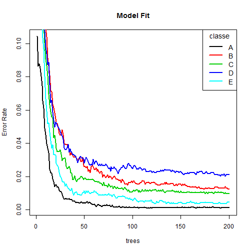

Manner Prediction
=============================
### Introduction
Using devices such as Jawbone Up, Nike FuelBand, and Fitbit it is now possible to collect a large amount of data about personal activity relatively inexpensively. These type of devices are part of the quantified self movement ¨C a group of enthusiasts who take measurements about themselves regularly to improve their health, to find patterns in their behavior, or because they are tech geeks. One thing that people regularly do is quantify how much of a particular activity they do, but they rarely quantify how well they do it. In this project, your goal will be to use data from accelerometers on the belt, forearm, arm, and dumbell of 6 participants. They were asked to perform barbell lifts correctly and incorrectly in 5 different ways. 

### Data Processing
#### Read Data

```r
library(caret)
```

```
## Loading required package: lattice
```

```
## Loading required package: ggplot2
```

```r
library(randomForest)
```

```
## randomForest 4.6-12
```

```
## Type rfNews() to see new features/changes/bug fixes.
```

```
## 
## Attaching package: 'randomForest'
```

```
## The following object is masked from 'package:ggplot2':
## 
##     margin
```

```r
if(!file.exists("training.csv"))
        download.file("https://d396qusza40orc.cloudfront.net/predmachlearn/pml-training.csv",destfile="training.csv")
if(!file.exists("testing.csv"))
        download.file("https://d396qusza40orc.cloudfront.net/predmachlearn/pml-testing.csv",destfile="testing.csv")

training<-read.csv("training.csv")
testing<-read.csv("testing.csv")
```


```r
summary(training$classe)
```

```
##    A    B    C    D    E 
## 5580 3797 3422 3216 3607
```

#### Feature Selection
There are 160 variables. That's a really large number so what we are going to do is to reduce the number using feature selection methods.

```r
# Remove zero covariates
mattrix<-nearZeroVar(training,saveMetrics = TRUE)
nzvtrain<-training[,-which(mattrix$nzv==TRUE)]

# Remove NA variables
propna<-apply(nzvtrain,2,function(x) mean(is.na(x)))
completetrain<-nzvtrain[,-which(propna>0.5)]

# Remove irrelevant variables
newtrain<-completetrain[,-(1:6)]
```
The number of variables is now 53.

#### Data Slicing
In this step, we split the train data set into two parts, a pure training set and a validation set.

```r
set.seed(1234)
inTrain<-createDataPartition(newtrain$classe,p=0.6,list=FALSE)
traindata<-newtrain[inTrain,]
testdata<-newtrain[-inTrain,]
```

### Model Fit
We try to use random forest method to fit the model. The reason is that random forest can effectively prevent over-fitting and its prediction is quite accurate. Also it automaticly selects important variables, which can be very useful for further study. We will use 5-fold cross validation when applying this algorithm and set the number of trees to grow to 200.

```r
rffit<-train(classe~.,data=traindata,method="rf",trControl=trainControl(method="cv",5),ntree=200)
```


```r
# Estimate on the validation set
pre<-predict(rffit,testdata)
mat<-confusionMatrix(testdata$classe,pre)
mat
```

```
## Confusion Matrix and Statistics
## 
##           Reference
## Prediction    A    B    C    D    E
##          A 2232    0    0    0    0
##          B   13 1499    6    0    0
##          C    0   10 1353    5    0
##          D    0    0   30 1254    2
##          E    0    0    3    1 1438
## 
## Overall Statistics
##                                          
##                Accuracy : 0.9911         
##                  95% CI : (0.9887, 0.993)
##     No Information Rate : 0.2861         
##     P-Value [Acc > NIR] : < 2.2e-16      
##                                          
##                   Kappa : 0.9887         
##  Mcnemar's Test P-Value : NA             
## 
## Statistics by Class:
## 
##                      Class: A Class: B Class: C Class: D Class: E
## Sensitivity            0.9942   0.9934   0.9720   0.9952   0.9986
## Specificity            1.0000   0.9970   0.9977   0.9951   0.9994
## Pos Pred Value         1.0000   0.9875   0.9890   0.9751   0.9972
## Neg Pred Value         0.9977   0.9984   0.9940   0.9991   0.9997
## Prevalence             0.2861   0.1923   0.1774   0.1606   0.1835
## Detection Rate         0.2845   0.1911   0.1724   0.1598   0.1833
## Detection Prevalence   0.2845   0.1935   0.1744   0.1639   0.1838
## Balanced Accuracy      0.9971   0.9952   0.9848   0.9952   0.9990
```

```r
accuracy<-mat$overall[1]
accuracy
```

```
##  Accuracy 
## 0.9910783
```
Above is a cross-tabulation of observed and predicted classes with associated statistics. We can see that the out-of-sample error is 0.89%.

Below is the final model plot.

```r
plot(1:200,rffit$finalModel$err.rate[,2],lwd=2,type="l",main="Model Fit",xlab="trees",ylab="Error Rate")
for(i in 3:6)
        lines(1:200,rffit$finalModel$err.rate[,i],lwd=2,type="l",col=i-1)
len<-length(traindata$classe)
legend("topright",legend=levels(traindata$classe),col=1:len,title="classe",cex=1.2,lwd=2)
```



This plot shows that as the number of trees grow larger for all five classe the error rates are all under 0.04.

### Prediction
Finally, we can use the above model to predict based on the test data set.

```r
name<-vector()
for(i in 1:length(names(newtrain))) 
        name<-c(name,which(names(training)==names(newtrain)[i]))
newtest<-testing[,name][,-length(name)]
predict(rffit,newtest)
```

```
##  [1] B A B A A E D B A A B C B A E E A B B B
## Levels: A B C D E
```

